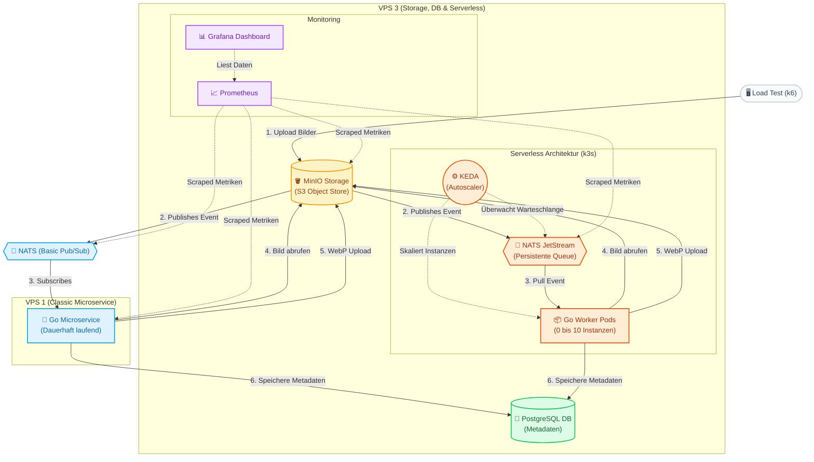

# Aktueller Stand der Architektur

Dieses Dokument fasst den aktuellen Stand des Serverless Image Processing Benchmarks zusammen. Wir betreiben parallel zwei völlig unterschiedliche Architekturen zur Bildverarbeitung, um deren Leistung, Ressourcenverbrauch und Skalierungsverhalten unter Last zu vergleichen.

## Architektur-Visualisierung

Hier ist eine detaillierte Visualisierung des Datenflusses und der Komponenten beider Architekturen.

## Systemübersicht

### 1. Klassische Microservice-Architektur (VPS 1)
- **Komponente:** Ein Go-Service (`vps1-microservice`), der dauerhaft als Docker-Container läuft, mit einem simplen lokalen NATS (`nats:alpine`).
- **Trigger:** MinIO sendet bei jedem Upload ein Event an das NATS-Topic (`MINIO_RAW_CLASSIC`).
- **Skalierung:** Intern über Go-Routinen. Der Service lädt die Events von NATS in eine **interne RAM-Warteschlange** (Go Channel, Limit: 100.000) und arbeitet sie mit einer statischen Anzahl an Workern ab.
- **Vorteil:** Sehr geringe Latenz, keine Kaltstarts.
- **Nachteil:** Verbraucht dauerhaft Ressourcen. Wenn der Container abstürzt, sind alle Events in der internen RAM-Warteschlange für immer verloren!

### 2. Serverless Architektur (VPS 3)
- **Komponente:** Event-getriebene Go-Worker Pods innerhalb eines Kubernetes-Clusters (k3s).
- **Trigger:** MinIO pusht Events in eine robuste, persistente **NATS JetStream** Queue (`MINIO_RAW_SERVERLESS`).
- **Skalierung:** **KEDA** überwacht die Länge dieser NATS-Warteschlange von außen. 
  - **Scale-to-Zero:** Bei leerer Warteschlange laufen **0 Instanzen** (kein Ressourcenverbrauch).
  - **Scale-Out:** KEDA startet dynamisch bis zu **10 Worker-Pods**, um die Last horizontal auf mehrere Container zu verteilen.
- **Vorteil:** Extrem ausfallsicher (Dank JetStream gehen keine Bilder verloren, falls ein Worker abstürzt, da erst nach erfolgreicher Verarbeitung ein ACK gesendet wird). Kosteneffizient im Leerlauf.
- **Nachteil:** Minimaler Overhead (Cold Start) beim Aufwecken der ersten Instanz.

### 3. State & Observability (VPS 3)
- **Speicher:** MinIO verwaltet alle Rohdaten (`images-raw-classic`, `images-raw-serverless`) und verarbeiteten Bilder (`images-processed`).
- **Datenbank:** PostgreSQL speichert die Metadaten zu jedem verarbeiteten Bild (Dateiname, Dauer, verarbeitete URL).
- **Monitoring:** Prometheus sammelt Metriken von MinIO, den Workern und cAdvisor/Kubelet. Grafana bietet uns das Live-Dashboard zum direkten Vergleich beider Ansätze während der Load Tests.

## Jüngste Anpassungen (Stand heute)
1. **Load Test UI Update:** Das Terminal im K6-Dashboard wurde entfernt, stattdessen wird eine prozentuale Fortschrittsanzeige neben dem Status integriert.
2. **Dashboard Lokalisierung:** Grafana und alle Dashboard-Bezeichnungen wurden komplett auf Deutsch umgestellt ("Vergleich Rohdaten in Backlog", "Serverless-laufende-Instances", etc.).
3. **Echtzeit-Metriken:** Der Serverless-Backlog im Dashboard wird nun nicht mehr über verzögerte Bucket-Counts, sondern in echter Echtzeit direkt über den NATS JetStream Consumer Lag (`jetstream_consumer_num_pending`) ausgelesen!
